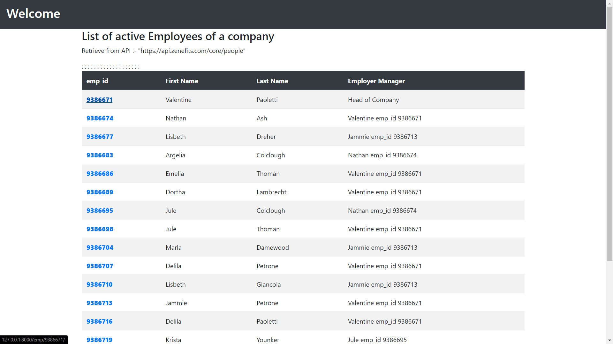
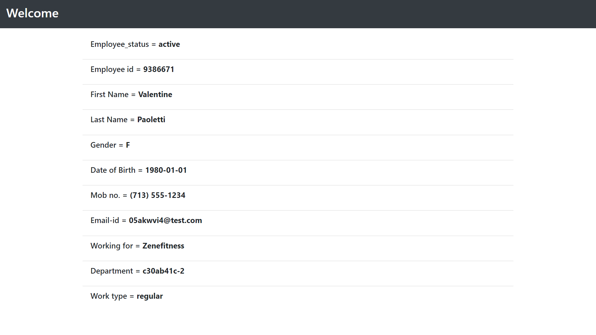

## Zenefits intern assignment 2020
A web app to display company employee data taken from **curl https://api.zenefits.com/core/people**.  
**Video demo** - [Click-Here!](https://drive.google.com/file/d/1NYvwZf21Cet0WHSioJTwHpDp-BQHqc4p/view?usp=sharing)
  
Some glimpse:-  
  
Where Emp_id is a hyper-link that direct you to a perticular employee information.  

  
**Sir, I research a lot but does not come up with a solution to how to use zenefits platform api to build org chart. But the main aim is to show employees infromation to a non technical user so I used a table that completely show all the employees of a company from zenefits core people api and also give a id link that redirect you to a specific relevent employee information.** 
